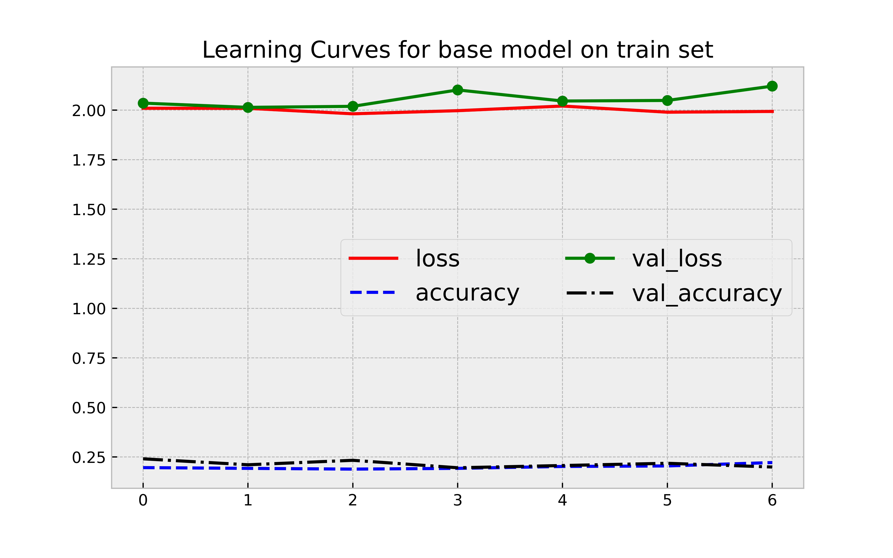
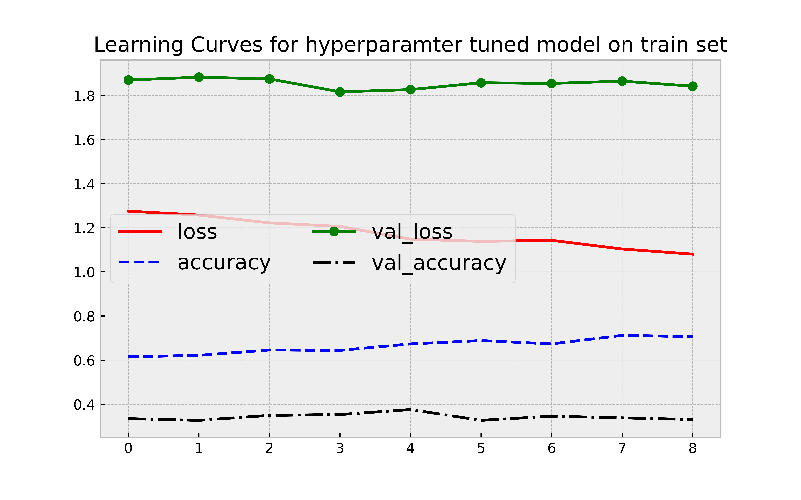
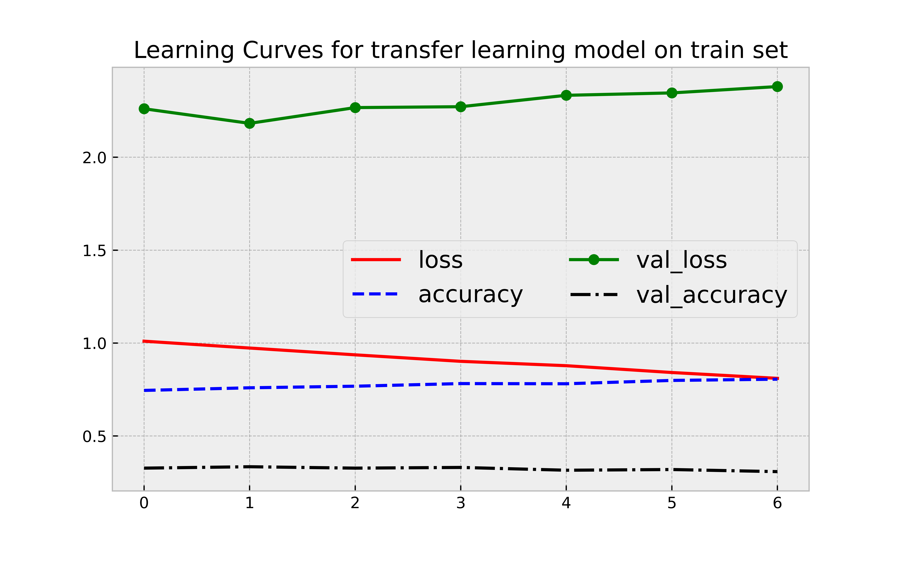
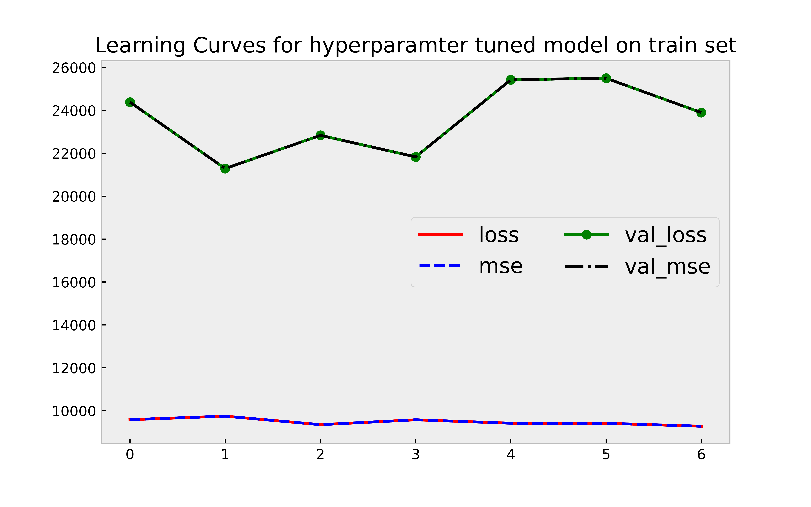

# Project 3

This is an **individual assignment**.

## Code Implementation & Technical Report

The final deliverables include a 4-page IEEE-format report, code implementation and a detailed GitHub readme file.

Project 2 is due Wednesday, December 7 @ 11:59 PM. Find the complete [rubric](https://ufl.instructure.com/courses/459156/assignments/5426774) in the Canvas assignment.

## Objectives of the project
* This project implements different architectures of artificial neural networks across two different datasets: 
* One is the flower species, which has 10 classes, and the other is the bounding box prediction of a car, which predicts the coordinates of the bounding box.
* The project also discusses the qualitative and quantitative metrics designed and used.

## Instructions for execution
* Open the training and testing notebooks on Hypergator
* Execute each cell one by one in order
* All the questions are answered in order along with the assumptions and explanation in comments

## Answering part for different test set
* If the user inputs a different test set, first thing the input it should be scaled
* All the preprocessing steps that were done on the train set should be replicated on the test set
* Transform the test set
* The input must be reshaped to the input layer shape
* For question - 1 the input must be reshaped to 75 x 75 x 3
* For question - 2 the input must be reshaped to 380 x 676 x 3

## Dataset 1: Flower Species Dataset

* The flower species dataset is available for [download here](https://ufl.instructure.com/courses/459156/files/folder/Project%203/Dataset%201%3A%20Flower%20Species%20Classification).
* The dataset was downsampled to 75 x 75 x 3 since the kernel was crashing
* Used three models - baseline, hyperparamter tuned model and transfer learning model
* Compared performance metrics across the three models

## Dataset 2: Object Detection Dataset

* The object detection dataset is available for [download here](https://ufl.instructure.com/courses/459156/files/folder/Project%203/Dataset%202%3A%20Object%20Detection).
* Used transfer learning model to predict the bounding box

## learning curves for question 1 

### model -1 : baseline  model

### model -2 : hyperparameter tuned model

### model -3 : transfer learning model

## learning curves for question 3

## saved models for question 1

* saved model-1 for question 1 [here](https://ondemand.rc.ufl.edu/node/c0800a-s35.ufhpc/42954/lab/tree/blue_eel4930/meganaagodhala/project-3-Meganaa999/model_b_1)
* saved model-2 for question 1 [here](https://ondemand.rc.ufl.edu/node/c0800a-s35.ufhpc/42954/lab/tree/blue_eel4930/meganaagodhala/project-3-Meganaa999/model_h_1)
* saved model-3 for question 1 [here](https://ondemand.rc.ufl.edu/node/c0800a-s35.ufhpc/42954/lab/tree/blue_eel4930/meganaagodhala/project-3-Meganaa999/model_t_1)

## Question -2 

* Built a qualitative index called as IOU index
* IOU = Area of Intersection/Area of Union 

## saved models for question 3

* saved model for question 3 [here](https://ondemand.rc.ufl.edu/node/c0800a-s35.ufhpc/42954/lab/tree/blue_eel4930/meganaagodhala/project-3-Meganaa999/model_h_3)

# Additional files and saved models

* All additional files required for training , testing can be found in the following [drive link](https://drive.google.com/drive/folders/1UYp8XUR5iVPp_3pM2b-Fp12SXvZPhMex?usp=sharing)

